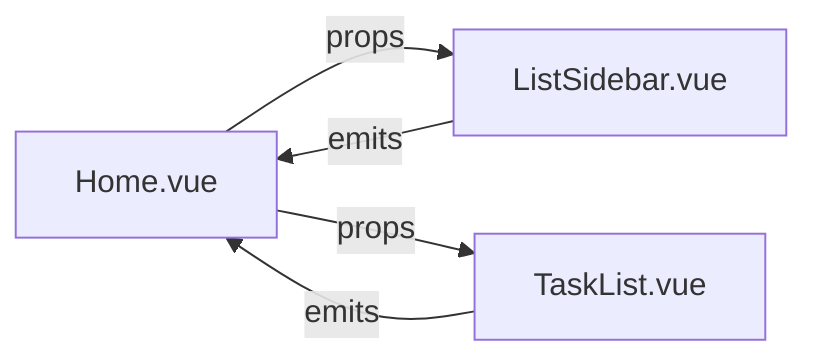

# TaskMaster Documentation

## Personal Task Management System

## Technical Specifications

### Frontend Implementation

#### Core Technologies

| Technology   | Usage                        | Version |
| ------------ | ---------------------------- | ------- |
| Vue 3        | Component-based architecture | 3.3.x   |
| Tailwind CSS | Responsive styling           | 3.3.x   |
| Vue Router\* | Navigation                   | 4.2.x   |

### State Management

- **Component Props/Emits** for parent-child communication
- **Reactive References (********`ref`********)** for local state
- **Event-driven Architecture** using `defineEmits`

---

## Component Structure

### 1. `Home.vue` (Root Component)

#### Responsibilities:

- Manages application state:
  ```javascript
  const lists = ref([...])
  const activeListId = ref(null)
  ```
- Handles all CRUD operations
- Coordinates between `ListSidebar.vue` and `TaskList.vue`

#### Key Methods:

```javascript
const addList = (newList) => {
  lists.value.push(newList);
  setActiveList(newList.id);
}
```

### 2. `ListSidebar.vue`

#### Features:

- Mobile-responsive design with a hamburger menu
- Color-coded list management
- Edit/Delete functionality

#### Props:

```javascript
defineProps({
  lists: Array,
  activeListId: [Number, null]
})
```

### 3. `TaskList.vue`

#### Features:

- Interactive task cards
- Progress tracking:
  ```javascript
  const progress = computed(() => ...)
  ```
- Due date visualization

---

## Setup Guide

### Development Environment

#### Install Dependencies:

```bash
npm install
```

#### Run Development Server:

```bash
npm run dev
```

### Production Build

```bash
npm run build
```

---

## Architecture Details

### State Flow



### Key Design Decisions

#### Component Communication

- Vue’s native event system is used instead of Pinia for simplicity.
- Parent component (`Home.vue`) maintains a **single source of truth**.

#### Mobile Optimization

- Dynamic sidebar with `transform: translateX` for smooth transitions.
- Touch-friendly tap targets for enhanced usability.

#### Performance Enhancements

- Computed properties for derived state calculations.
- `Teleport` is used for better modal positioning.

---

##

